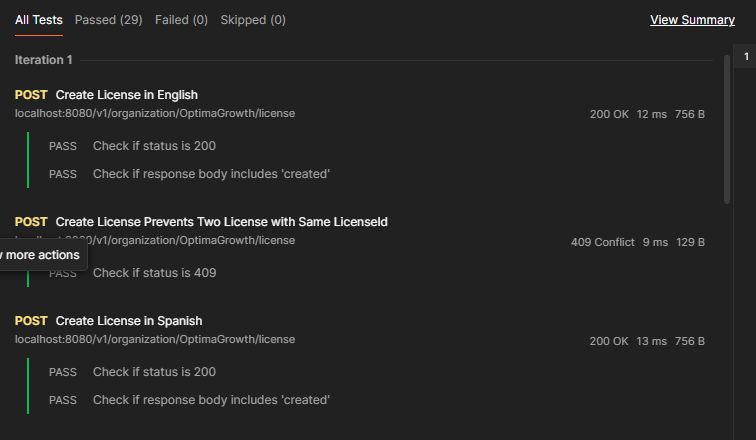
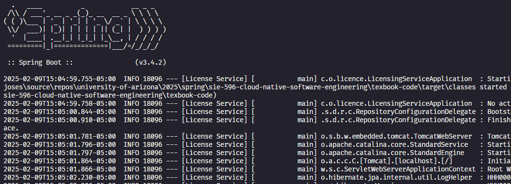

# Textbook: Spring Microservices in Action

This is a project to follow the _SIE 596 Cloud Native Software Engineering_ texbook:

Spring Microservices in Action, Second Edition by John Carnell

# Usage
Each chapter of the book will have its own branch on this project. Chapter branches will not be merged wil main.
If you want to follow the code for a specific chapter, then got to the appropiate branch. Main branch will only contain readmes, general git configurations and other general files.

# Running the application
## Pre-requisites
- [Install Postman](https://www.postman.com/downloads/)
- (Optional) [Install MVN](https://maven.apache.org/download.cgi)
## Testing with Postman
1. Open [Postman](https://learning.postman.com/docs/introduction/overview/).
1. Go to your collections and import `./http-tests/license-endpoints-test.har` into your Postman/Insomnia collections. That .har document has a JSON represantion of all of the enpoints in the License web service.
1. Follow the instrusctions below to start the application.
1. Run the collection.
1. The collection is pre-populated with tests. You should see test results like these after runngin the collection:

   

## Start the Application
1. Clone the repository.
1. Run the application.
    - If you installed MVN use this command:

      ```
      mvn spring-boot:run
      ```

    - If you did not install MVN use this command:

      ```
      ./mvnw spring-boot:run
      ```
1. Expect this in your terminal if the application starts succesfully:

   
